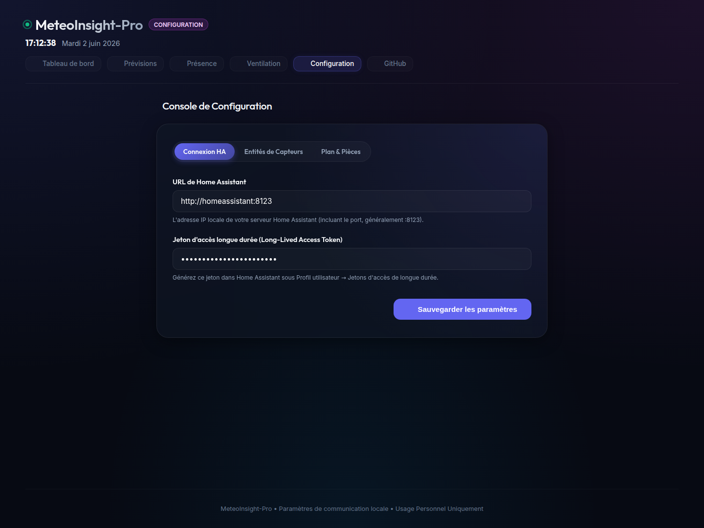

# MeteoInsight-Pro | Station Météo Connectée & Tableau de Bord Domotique

MeteoInsight-Pro est une console intelligente et moderne de suivi météorologique local et de gestion domotique, interfacée directement avec **Home Assistant**. Elle intègre de la modélisation statistique et des algorithmes de Machine Learning locaux (KNN, régressions linéaires) pour prédire le climat intérieur/extérieur, estimer l'affluence des pièces et fournir des recommandations d'aération adaptées (calculs d'humidité absolue).

Développé pour un usage personnel et communautaire, MeteoInsight-Pro est entièrement modulable : vous pouvez concevoir votre plan de maison 2D et associer vos capteurs dynamiquement depuis l'interface web, sans modifier une seule ligne de code.

---

## 📸 Aperçu de l'Interface

### 1. Tableau de bord principal (Plan 2D)

*Visualisation interactive 2D de votre logement avec calques thermiques, éclairage, humidité relative, mouvements en direct et position animée de votre aspirateur Roborock.*

### 2. Modèles de Prévisions (Heuristiques vs Machine Learning)

*Comparaison en temps réel entre les règles physiques empiriques (gradients barométriques) et un modèle KNN local entraîné sur votre historique Home Assistant.*

### 3. Console de Configuration Intégrée

*Interface d'administration complète et sécurisée pour gérer vos identifiants HA, vos 21 entités de capteurs et la disposition de vos pièces en JSON avec validateur intégré.*

---

## 🚀 Fonctionnalités Clés

* **Plan Interactif 2D Dynamique** : Dessiné dynamiquement en SVG sur le client en fonction de vos configurations de pièces. Supporte les calques d'affichage thermique, luminosité ambiante (lux), humidité relative, qualité de l'air (CO2/PM2.5), bruit (dB) et présence.
* **Prévisions Météo à double modèle** :
  * *Modèle Physique* : Analyse des tendances de variations barométriques et d'humidité relative à horizon 3h, 6h, 12h et 24h.
  * *Modèle Machine Learning* : Algorithme KNN (K-Nearest Neighbors) auto-entraîné localement sur les 7 derniers jours d'historique de votre station.
* **Gestion Thermique & Aération prédictive** :
  * Calcul en temps réel de l'**Humidité Absolue (g/m³)** intérieure et extérieure pour estimer si l'aération asséchera ou humidifiera l'habitat.
  * Projections de température à 24h par régression linéaire (tenant compte de la météo, de la couverture nuageuse et du vent).
  * Calcul de la prochaine heure de croisement des courbes pour afficher un compte à rebours exact avant d'ouvrir ou fermer les fenêtres.
* **Analyse d'Affluence sur 30 jours** : Agrégation de vos historiques de détecteurs de mouvement sur 30 jours pour dessiner une courbe de rythme d'activité horaire sur 24h et optimiser vos scénarios de chauffage ou d'éclairage.
* **Contrôle Bidirectionnel Roborock** : Boutons d'action rapides (lancer le nettoyage, retour à la base) et animation dynamique de l'aspirateur en zigzag dans sa pièce de nettoyage actuelle.
* **Console de Paramétrage Sécurisée** : Sauvegarde immédiate à chaud de vos configurations, avec masquage automatique des jetons de sécurité.

---

## 🛠️ Installation & Démarrage

### Prérequis

* **Node.js** (v16 ou supérieur)
* Une instance **Home Assistant** accessible avec un jeton d'accès de longue durée (Long-Lived Access Token).

### 1. Cloner et Installer les Dépendances

```bash
git clone https://github.com/PolgeBenjamin/MeteoInsight-Pro.git
cd MeteoInsight-Pro
npm install
```

### 2. Initialiser la Configuration

Copiez le modèle de configuration par défaut :

```bash
cp config.json.example config.json
```

Démarrez ensuite le serveur et connectez-vous sur l'interface pour saisir vos identifiants Home Assistant et mapper vos capteurs depuis la console.

### 3. Lancer l'Application

En mode développement :
```bash
npm run dev
```

En production avec **PM2** (pour assurer la résilience et le lancement au démarrage) :
```bash
# Installer PM2
npm install -g pm2

# Lancer l'application
pm2 start server.js --name "meteo-insight-pro"

# Enregistrer la configuration PM2 au démarrage
pm2 startup
pm2 save
```

L'application est par défaut accessible à l'adresse : `http://localhost:3000` (ou port configuré).

---

## 📐 Personnalisation du Plan 2D (JSON)

Depuis l'onglet **Plan & Pièces** de la console de configuration, vous pouvez ajuster les coordonnées SVG des pièces de votre maison. Les coordonnées `x`, `y`, `w`, `h` sont relatives à une boîte de dessin globale de **500x500** pixels :

```json
{
  "id": "cuisine",
  "label": "Cuisine",
  "x": 195,
  "y": 335,
  "w": 160,
  "h": 145,
  "tempEntity": "sensor.alexa_cuisine_temperature",
  "lightEntity": "sensor.alexa_cuisine_eclairement",
  "motionEntity": "binary_sensor.alexa_cuisine_mouvement",
  "humEntity": "sensor.netatmo_humidite",
  "clickable": true
}
```

---

## 🛡️ Licence & Conditions d'Utilisation

Ce projet est distribué sous la licence **Propriétaire - Usage Personnel et Non-Commercial Uniquement**. 

Vous êtes autorisé à :
* Utiliser, copier, modifier et adapter ce logiciel à des fins personnelles et éducatives.
* Partager vos modifications sous forme de contributions au dépôt d'origine.

Il est strictement interdit de :
* Vendre, louer, concéder sous licence ou utiliser ce logiciel (ou toute partie dérivée) à des fins commerciales.
* Distribuer ce logiciel sans inclure l'avis de copyright et la licence d'origine.

Pour plus de détails, veuillez consulter le fichier `LICENSE` joint à ce dépôt.
