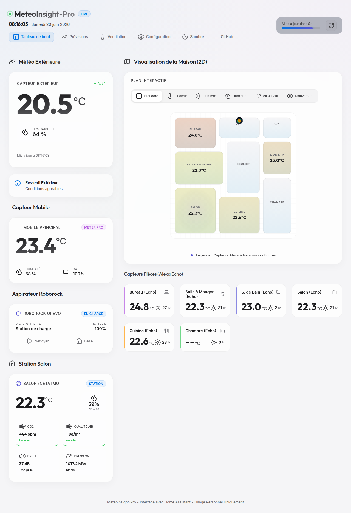
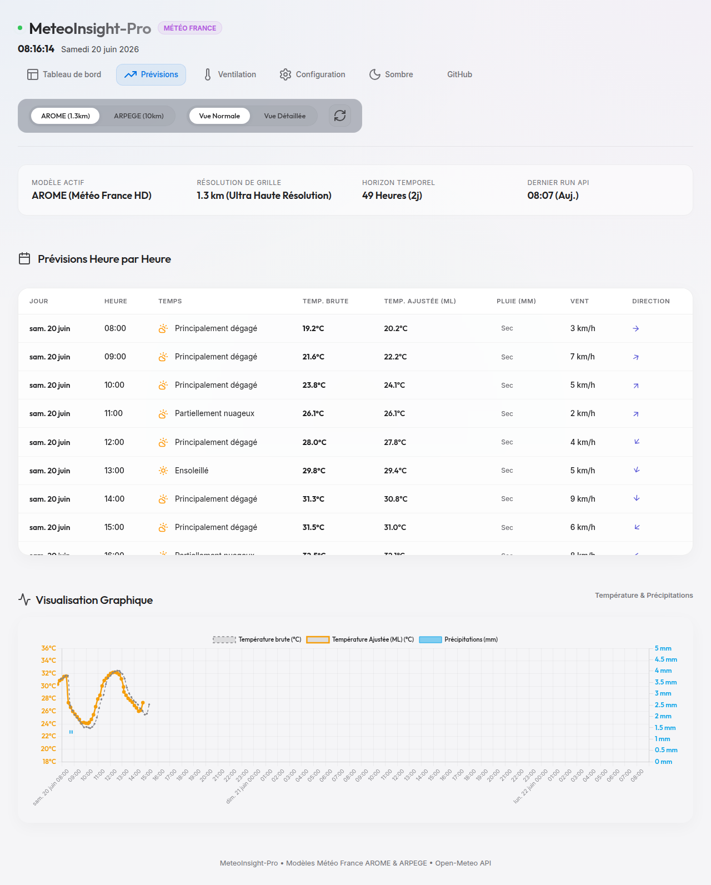

# 🌦️ MeteoInsight-Pro

> **Console intelligente de suivi météo local et gestion domotique par Machine Learning, interfacée avec Home Assistant.**

MeteoInsight-Pro est une application web moderne conçue pour le suivi climatique et la gestion thermique d'un habitat. En s'appuyant sur des prévisions à haute résolution (**Météo-France AROME**) et les données de vos capteurs **Home Assistant**, l'application utilise des modèles d'apprentissage automatique locaux pour corriger les prévisions brutes aux spécificités de votre micro-climat local et optimiser la ventilation de votre logement.

---

## 📸 Aperçu de l'Interface

| 🖥️ Tableau de bord principal | 🌦️ Prévisions ML vs Heuristiques |
| :---: | :---: |
|  |  |
| *Plan 2D interactif avec calques physiques (thermique, CO2, présence) et suivi en direct Roborock.* | *Comparaison en temps réel des modèles physiques, KNN locaux et corrections de biais AROME.* |

---

## 🚀 Fonctionnalités Clés

### 🧠 Intelligence Artificielle & Modèles Prédictifs
* **Double Modèle de Prévisions (Heuristiques vs KNN)** :
  * *Modèle Physique (Heuristique)* : Analyse des tendances de variations barométriques et d'humidité relative à horizon 3h, 6h, 12h et 24h.
  * *Modèle Machine Learning (KNN)* : Algorithme KNN (K-Nearest Neighbors) auto-entraîné localement sur les 7 derniers jours d'historique de votre station Home Assistant.
* **Correction de biais ML (AROME - Micro-climat local)** : Un modèle de régression Ridge régularisée (fenêtre glissante de 30 jours) compare les prévisions de grille AROME avec vos mesures réelles de température extérieure. Il corrige l'effet d'îlot de chaleur nocturne et d'ombrage diurne pour adapter la prévision à la réalité thermique immédiate de la maison.
* **Projections thermiques des pièces à 24h** : Calcul prédictif de l'évolution de la température intérieure de chaque pièce par régression linéaire (utilisant la **température extérieure ajustée par ML (AROME)**, le rayonnement solaire direct/diffus estimé, l'exposition des fenêtres de chaque pièce et l'impact dynamique de la vitesse/orientation du vent).

### 💨 Gestion de l'Aération (Confort Hygrothermique)
* **Humidité Absolue ($g/m^3$)** : Comparaison de la concentration d'eau réelle dans l'air pour savoir si l'ouverture des fenêtres va réellement assécher ou humidifier le logement.
* **Indicateur d'Ouverture optimal** : Calcul automatique et compte à rebours précis indiquant la meilleure heure pour ouvrir ou fermer les fenêtres afin de conserver la fraîcheur ou d'assécher l'air.

### 🏡 Cartographie 2D & Domotique
* **Plan 2D SVG Dynamique** : Dessiné dynamiquement en fonction de la configuration de vos pièces. Supporte les calques d'affichage thermique, lux, humidité, qualité de l'air (CO2/PM2.5), bruit (dB) et présence.
* **Intégration Aspirateur (Roborock)** : Visualisation de l'aspirateur en direct sur le plan 2D dans sa pièce de nettoyage, avec commandes bidirectionnelles rapides.
* **Console de Configuration Intégrée** : Interface d'administration complète et sécurisée pour gérer vos jetons de sécurité HA et la disposition géométrique de vos pièces.

---

## 🛠️ Installation & Démarrage

### Prérequis
* **Node.js** (v18 ou supérieur)
* Une instance **Home Assistant** fonctionnelle avec un jeton d'accès longue durée (Long-Lived Access Token).

### 1. Installation
```bash
git clone https://github.com/PolgeBenjamin/MeteoInsight-Pro.git
cd MeteoInsight-Pro
npm install
```

### 2. Configuration
Créez votre fichier de configuration local :
```bash
cp config.json.example config.json
```
*Note : Le fichier `config.json` contient vos secrets locaux et est configuré pour être automatiquement ignoré par Git.*

### 3. Lancement
En développement :
```bash
npm run dev
```

En production avec **PM2** :
```bash
npm install -g pm2
pm2 start server.js --name "meteo-insight-pro"
pm2 startup && pm2 save
```

L'application sera accessible par défaut sur `http://localhost:3000` (ou port configuré).

---

## 📐 Exemple de Configuration de Pièce (JSON)

Les dimensions `x, y, w, h` sont définies sur une grille de dessin de `500x500` pixels :
```json
{
  "id": "salon",
  "label": "Salon",
  "x": 20,
  "y": 300,
  "w": 160,
  "h": 180,
  "tempEntity": "sensor.netatmo_temperature",
  "humEntity": "sensor.netatmo_humidite",
  "motionEntity": "binary_sensor.alexa_salon_mouvement",
  "windowOrientation": 180,
  "clickable": true
}
```

---

## 🛡️ Licence
Ce projet est distribué sous la licence **Propriétaire - Usage Personnel et Non-Commercial Uniquement**. 
Pour plus de détails, veuillez consulter le fichier `LICENSE` joint.
